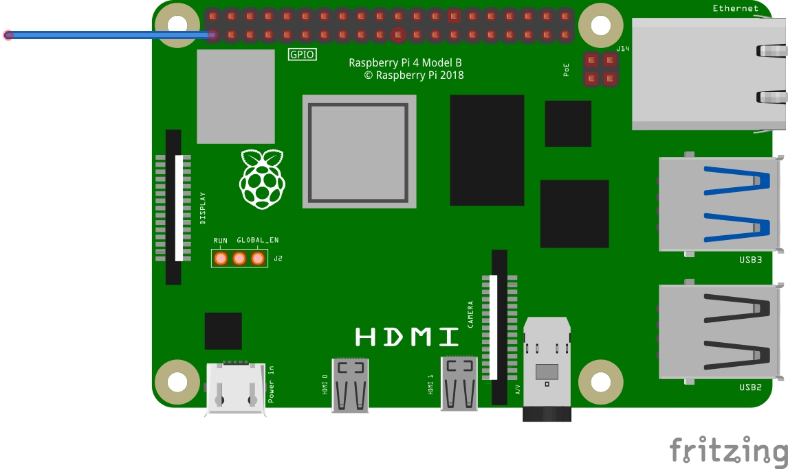
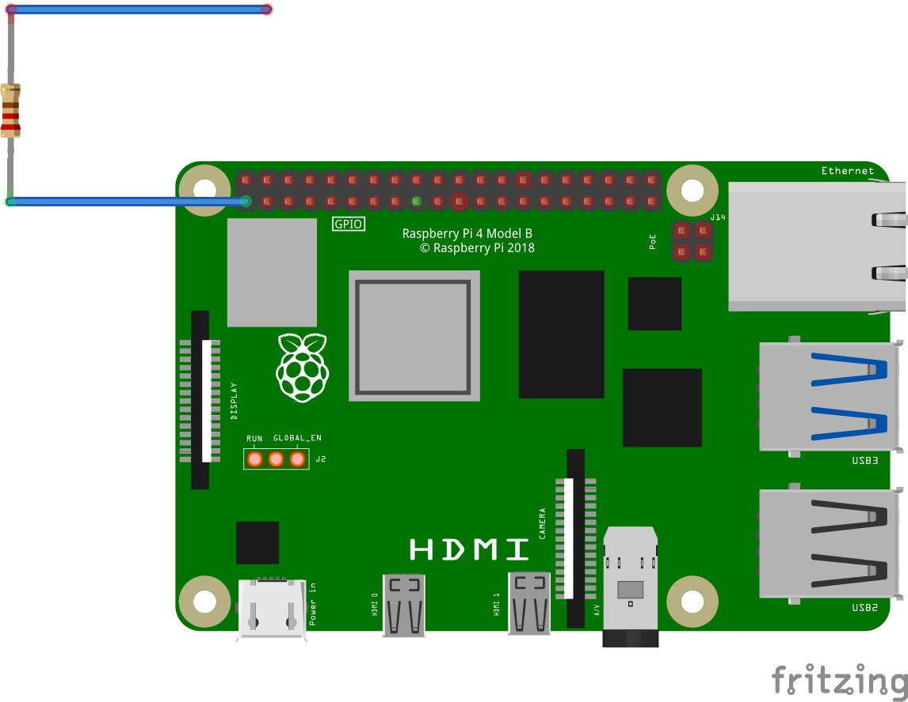
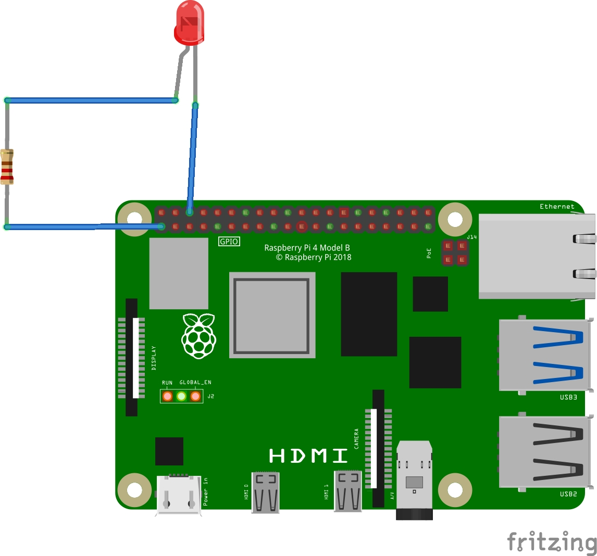

## Test your circuit

In this step, you will connect an LED and resistor to the Raspberry Pi to test your circuit.

--- task ---
Your jumper wire should have hollow female ends that fit over the pins. Connect a jumper wire to Pin 1, making sure it is a female to female wire. Pin 1 is always on and provides 3 volts of power to whatever you connect to it.  

--- /task ---

--- task ---

Take a resistor and insert one of it’s legs into the other end of the jumper cable attached to Pin 1. Insert the other leg into another female-female jumper cable. 
We add a resistor to our circuit to control the **electrical current** passing through it, to protect the LED from burning out.

--- /task ---

--- task ---

Insert the **long** leg of your LED into the end of this jumper cable, and connect the short leg back to Pin6 using another female-female jumper cable. As soon as you close the circuit by connecting it back to your ground pin, your LED will light up! 

--- collapse ---
---
title: Help: My LED isn't working!
---
If your LED isn't lighting up, make sure you have the **long leg** connected to the output pin (Pin 1) and the **short leg** connected to the ground pin (Pin 6). LEDs only work one way round!

If your LED **still** isn't lighting up: check all your connections are secure and fit properly, then swap your LED for another one if it still won't work (this one might be broken).
--- /collapse ---

--- /task ---

In the next step, we will swap our working circuit to a numbered control pin so that we can drive it using code!
