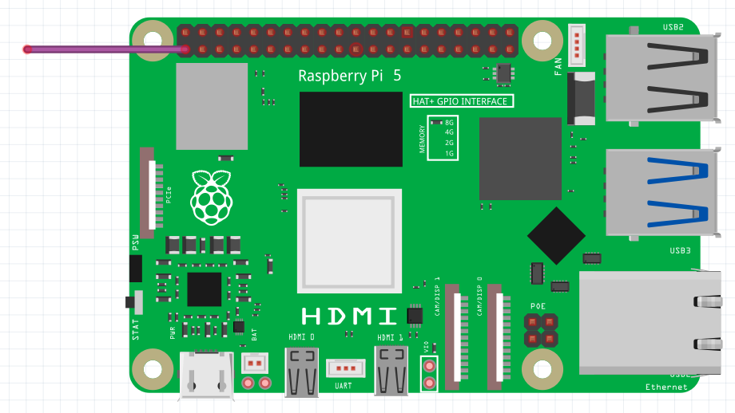
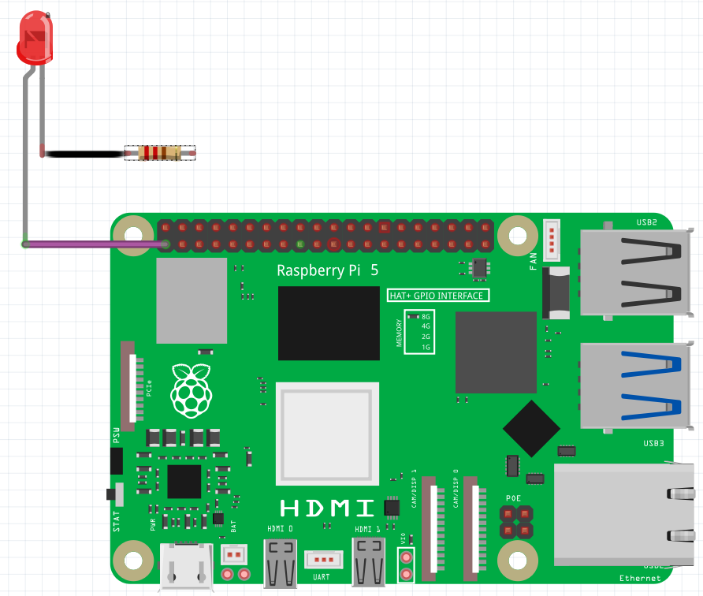

## Test your circuit

In this step, you will connect an LED and resistor to the Raspberry Pi's GPIO pins to test your circuit.

GPIO stands for **G**eneral **P**urpose **I**nput/**O**utput. GPIO pins allow you to create simple machines by sending a small electrical signal out of a pin, down a wire, through an output or input, and back into a ground pin on the Raspberry Pi to create a circuit. The behaviour of the circuits you make can be programmed and controlled through programs written by you, using Scratch!

--- task ---
Your jumper cables should all have hollow 'F' ends that fit over the pins. 

Connect a jumper cable to Pin 1, making sure it is an F-F wire. Pin 1 is always on and provides 3 V of power to whatever you connect to it.  

--- /task ---

--- task ---
Insert the **long leg** of your LED into the other end of this jumper cable. Take a second F-F jumper cable and attach it to the **short leg** or your LED.

--- /task ---

--- task ---
Take a resistor and insert one of it’s legs into the other end of the second jumper cable. Insert the other leg into another F-F jumper cable. Adding the resistor to your circuit controls the **electrical current** passing through the circuit; this will protect the LED from burning out. 

--- /task ---

--- task ---
Now, connect your circuit back to Pin 6 using the the loose end of the F-F jumper cable. As soon as you close the circuit by connecting it back to your ground pin, your LED should light up! 

--- collapse ---
---
title: Help - My LED isn't working!
---
If your LED isn't lighting up, make sure you have the **long leg** connected to the output pin (Pin 1) and the **short leg** connected to the ground pin (Pin 6). LEDs only work one way round!

If your LED **still** isn't lighting up, check all your connections are secure and fit properly, then swap your LED for another one if it still won't work (this one might be broken).
--- /collapse ---

--- /task ---

In the next step, you will swap your working circuit to a numbered control pin so that you can drive it using code!
