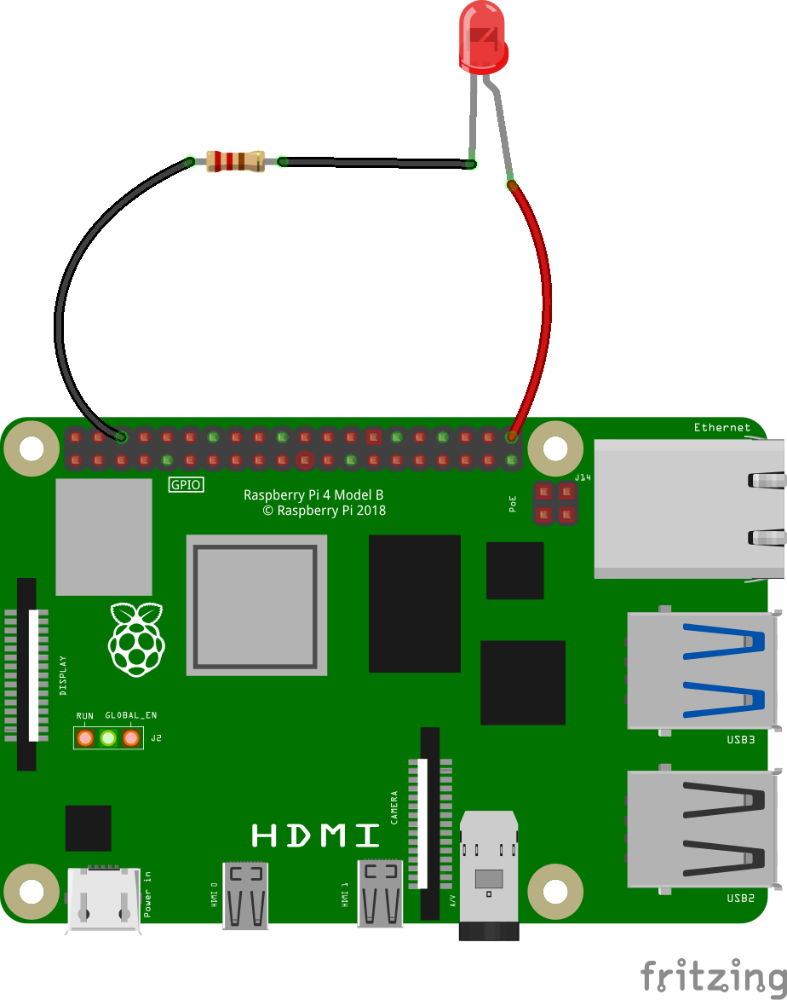
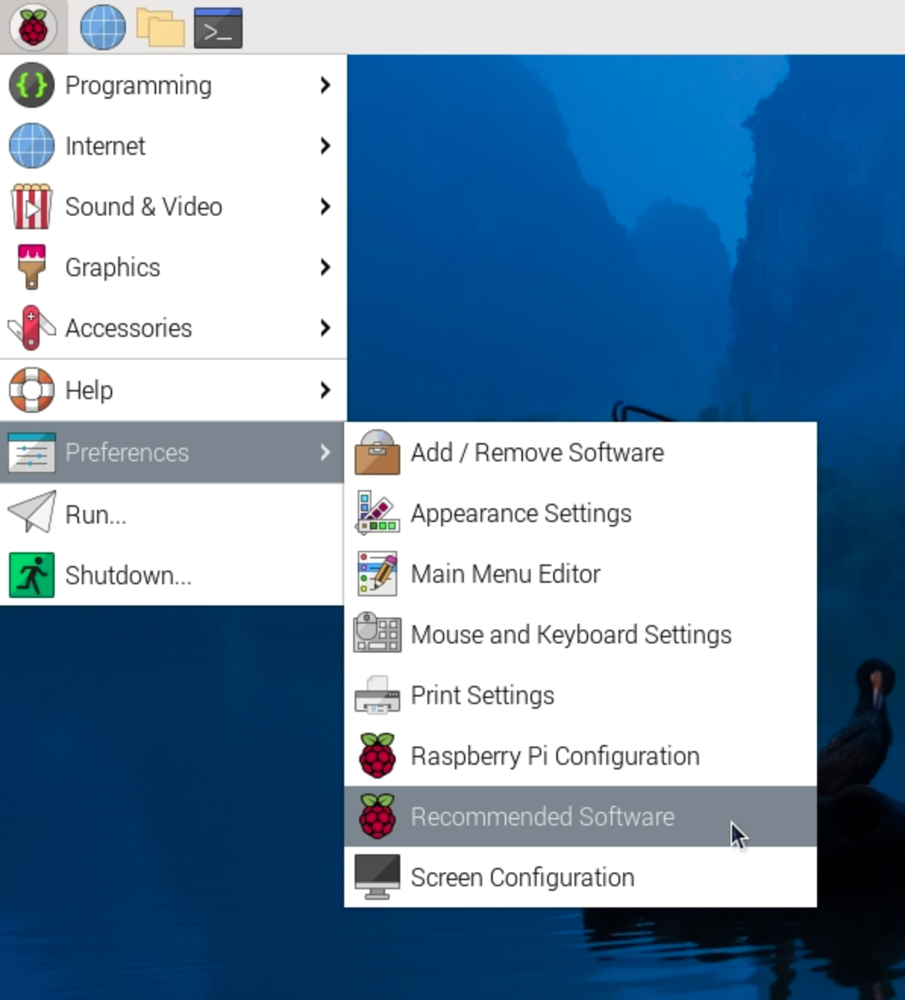
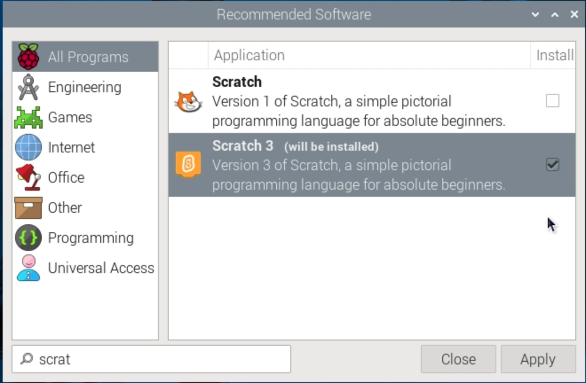

## Code your circuit

In this step, you will write Scratch code so that your LED lights up when the player is near the hedgehog.

--- task ---
Take the jumper wire off Pin 1 and attach it to **Pin 21** instead. Pin 21 is a pin which can be controlled with Scratch code.



--- /task ---

--- task ---

On the Raspberry Pi, download and open the [starter project](https://rpf.io/p/en/scratch-led-game-get){:target="_blank"}.


--- collapse ---
---
title: Installing Scratch 3 desktop
---

Click on the Raspberry Pi logo, then **Preferences**, then **Recommended software**.



Find **Scratch 3** in the list of software, tick the box and then click **Apply** to install it.



--- /collapse ---

--- collapse ---
---
title: Opening a downloaded Scratch 3 Desktop project
---

Once you have downloaded the zip file from the link above, open your file manager and navigate to the **Downloads** folder.

Find the file you just downloaded. It will end in `.zip`.

Right click on the file and choose 'Extract here' to extract them to your downloads folder.

In Scratch 3 Desktop, click the `File` menu and choose `Load from your computer`.

Navigate to your downloads folder again and select the file `scratch-physcomp1.sb3`. 

Click `OK` or press `Enter`.


--- /collapse ---

--- /task ---

--- task ---

Make sure you have the **Stage** selected.

Using the `Simple Electronics`{:class="block3extensions"} extension, add the following blocks into the `if`{:class="block3control"} block.

```blocks3
when green flag clicked
forever
if <[0] < (dist) > then
+turn LED (21 v) [on v] ::led extension
else
+turn LED (21 v) [off v] ::led extension
end
```

If the distance to the hedgehog is less than it was before (ie. a number less than 0), the LED turns on — `else`{:class="block3control"} it turns off.

--- /task ---

--- task ---

Now click on the green flag, and use the arrow keys and the LED to hunt the hedgehog!

--- /task ---

--- save ---
