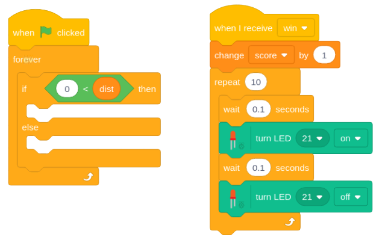

## Code your circuit

In this step, you will connect your completed circuit to an output pin on the Raspberry Pi and control it using code.

--- task ---
Our circuit is working and our LED is lit, but we want it to run when something happens in our Scratch program. 

In order to do that, we need to connect our LED circuit to an output pin on the Pi. Simply take the jumper cable off of Pin 1 and attach it to any other numbered Pin. In this example, I’ve used Pin 21 (because it’s easy to get to) but you can use any numbered GP pin on your Raspberry Pi.


--- /task ---

--- task ---

Download and open the premade Scratch project [available here](https://www.youtube.com/watch?v=dQw4w9WgXcQ){:target="_blank"}.

--- /task ---

--- task ---
Make sure you have the **Stage** selected and can see the following scripts:

--- /task ---
--- task ---
Using the **Simple Electronics** Extension, add the following blocks into the **if** block so that if **distance** is less than 10, the LED comes on - **else** it turns off.
```blocks3
turn LED (21 v) [on v] ::extension hat

turn LED (21 v) [off v] ::extension hat
```
--- /task ---
