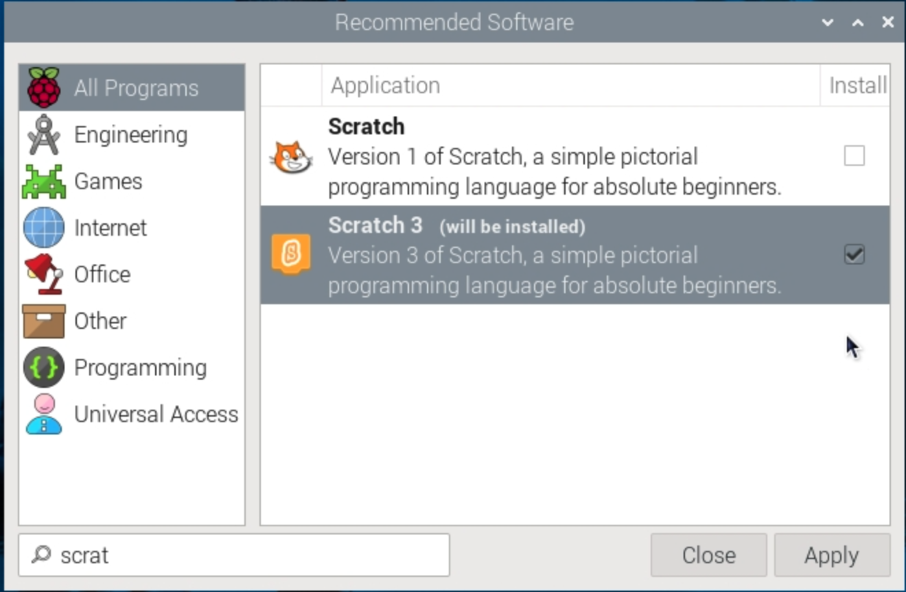

## You will make

Create a game where the player must find the hidden hedgehog. The LED turns on when you are close to the hedgehog.

--- no-print ---

### Joue ▶️
Voir une version « virtuelle » du projet système interactif terminé. Déplace ton personnage sur l'écran en utilisant les touches fléchées. When you move closer to the hedgehog, the LED will appear on the screen. If you move away, it will disappear.

  <iframe allowtransparency="true" width="485" height="402" src="https://scratch.mit.edu/projects/embed/492829675/?autostart=false" frameborder="0"></iframe>

--- /no-print ---

--- print-only ---  --- /print-only ---

## You will need

### Matériel informatique

+ Un ordinateur Raspberry Pi
+ 3 x socket-to-socket jumper cables
+ une LED
+ a resistor (47-330Ω)

### Logiciel

+ Scratch 3 Desktop - This project can not be completed using the online Scratch 3 editor, and must be completed using a Raspberry Pi with the desktop version installed.

--- collapse ---
---
title: Installing Scratch 3 desktop
---

Click on the Raspberry Pi logo, then **Preferences**, then **Recommended software**.

Find **Scratch 3** in the list of software, tick the box and then click **Apply** to install it.

--- /collapse ---
