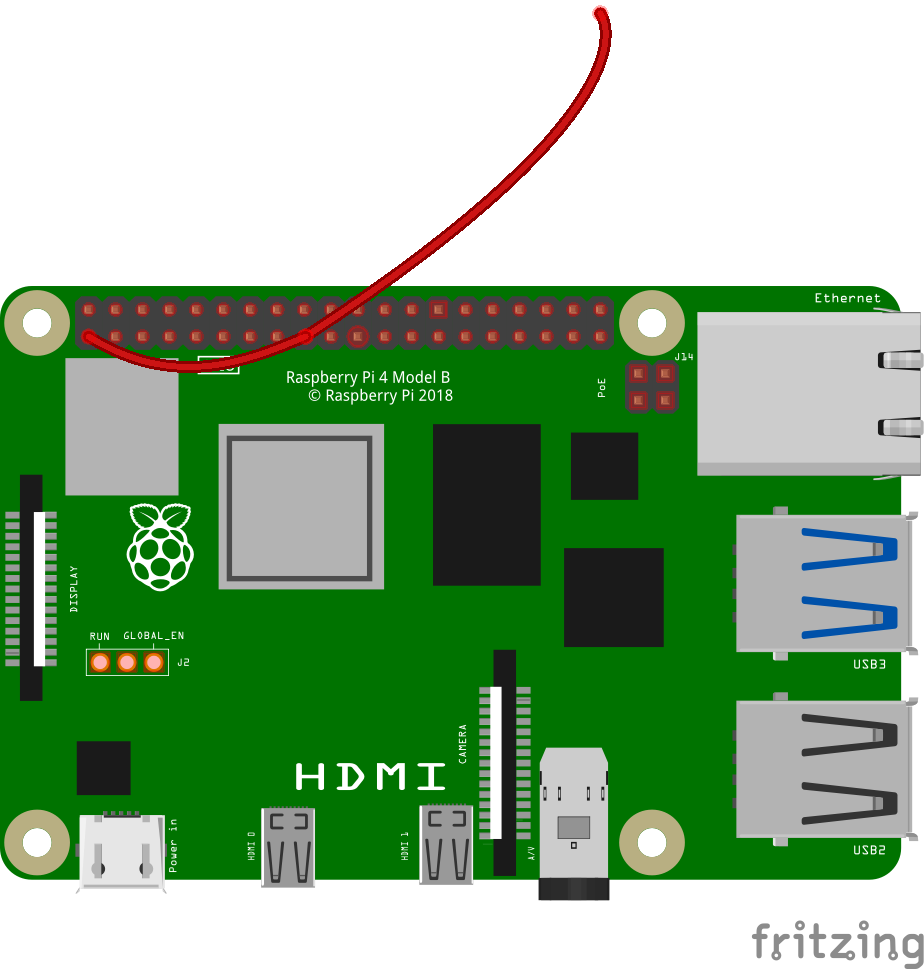

## Tester ton circuit

In this step, you will connect an LED to your Raspberry Pi. You will need:

- An LED
- Three socket-to-socket jumper wires
- A resistor (47Ω is best)
- A Raspberry Pi

--- task ---

Connect a **jumper wire** to the pin on your Raspberry Pi shown in the diagram. This is Pin 1 - it provides power.

--- /task ---

--- task ---

Insert the **long leg** of your LED into the other end of this jumper wire.

--- /task ---

--- task ---

Take a second socket-to-socket jumper wire and attach it to the **short leg** of your LED.

It should look like this: 

--- /task ---

--- task ---

Take a resistor and insert one of its legs into the free end of the second jumper wire.

L'ajout de la résistance à ton circuit réduit le **courant électrique** traversant le circuit ; cela empêchera la LED de griller.

--- /task ---

--- task ---

Insert the other leg of the resistor into another socket-to-socket jumper wire:

--- /task ---

--- task ---

Now, connect the loose jumper wire to **Pin 6** as shown in the diagram; this is a **ground** pin.

Dès que tu fermes le circuit en le connectant à ta broche GND, ta LED devrait s'allumer !

--- /task ---

--- collapse ---
---
title: À l'aide, ma LED ne fonctionne pas !
---
Si ta LED ne s'allume pas, assure-toi que la **patte longue** est connectée à la broche de sortie (broche 1) et la **patte courte** est connectée à la broche de masse (broche 6). Les LED ne fonctionnent que dans un sens !

Si ta LED **ne s'allume toujours pas**, vérifie que toutes tes connexions sont bien fixées et s'ajustent correctement, puis remplace ta LED par une autre si elle ne fonctionne toujours pas (celle-ci est peut-être cassée).

--- /collapse ---

--- collapse ---
---
title: I want to know more about GPIO
---

GPIO signifie **G**eneral **P**urpose **I**nput/**O**utput. Les broches GPIO te permettent de créer des machines simples en envoyant un petit signal électrique à partir d'une broche, sur un fil, par une sortie ou une entrée, et retourne dans une broche de terre sur le Raspberry Pi pour créer un circuit. Tu peux programmer et contrôler les circuits que tu crées grâce à des programmes écrits avec Scratch !

The jumper cables we use for prototyping have what are called **dupont connectors** on the ends of them to make it easy to create circuits and connect components. These connectors come in two main types: **Pin** and **Socket**. **Pin** connectors are so called because they have a small metal pin sticking out, while **socket** connectors have a small port that accepts a pin to make a connection.

--- /collapse ---
