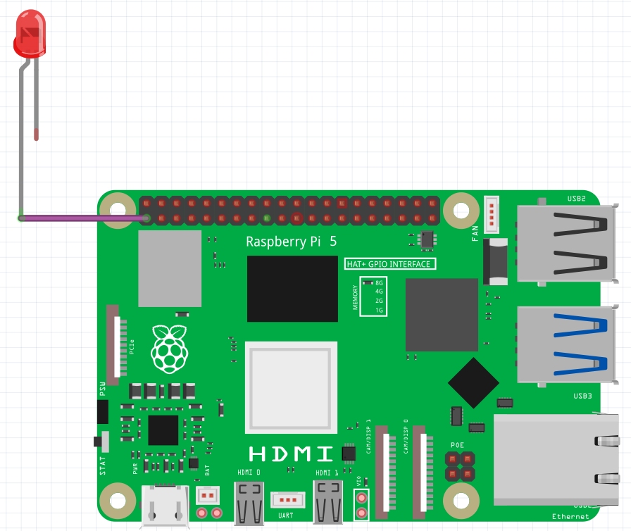
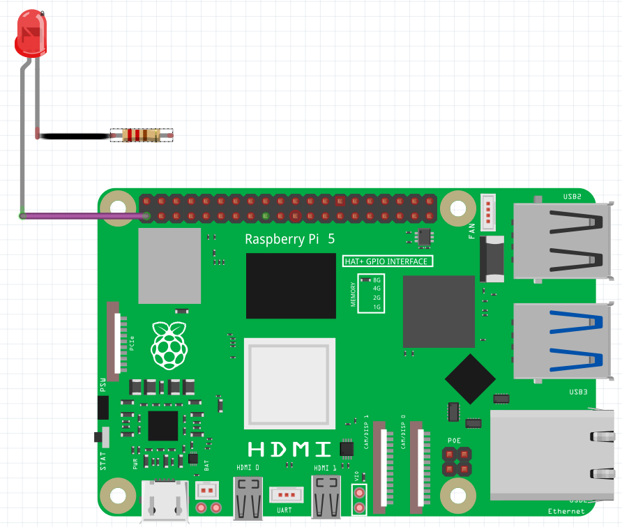

## Tester ton circuit

Dans cette étape, tu vas connecter une LED et une résistance aux broches GPIO du Raspberry Pi pour tester ton circuit.

GPIO signifie **G**eneral **P**urpose **I**nput/**O**utput. Les broches GPIO te permettent de créer des machines simples en envoyant un petit signal électrique à partir d'une broche, sur un fil, par une sortie ou une entrée, et retourne dans une broche de terre sur le Raspberry Pi pour créer un circuit. Tu peux programmer et contrôler les circuits que tu crées grâce à des programmes écrits avec Scratch !

Les câbles de liaison que nous utilisons pour le prototypage ont ce que l'on appelle des **connecteurs dupont** aux extrémités de ces câbles pour faciliter la création de circuits et de composants de connexion. Ces connecteurs sont fournis en deux types principaux : **Broche** et **Prise**. Les connecteurs **Broche** sont appelés ainsi parce qu'ils ont une petite broche en métal, alors que les connecteurs **Prise** ont un petit port qui accepte une broche pour faire une connexion.

--- task --- Tes fils de liaison devraient tous avoir des extrémités de support creux qui correspondent aux broches de ton Raspberry Pi.

Connecte un fil de liaison à la broche 1. La broche 1 est toujours allumée et fournit 3,3 volts à tout ce que tu y connectes.

--- /task ---

--- task --- Insère la **longue patte** de ta LED dans l'autre extrémité de ce fil de liaison. Prends un deuxième fil de liaison prise - prise et fixe-le à la **patte courte** de ta LED.

--- /task ---

--- task --- Prends une résistance et insère l'une de ses pattes dans l'extrémité libre du second fil de liaison. Insère l'autre patte dans un autre fil de liaison prise - prise. L'ajout de la résistance à ton circuit réduit le **courant électrique** traversant le circuit ; cela empêchera la LED de griller.

 --- /task ---

--- task --- Maintenant, connecte ton circuit à la broche 6 en utilisant la prise libre du fil de liaison. Dès que tu fermes le circuit en le connectant à ta broche GND, ta LED devrait s'allumer !

--- collapse ---
---
title: À l'aide, ma LED ne fonctionne pas !
---
Si ta LED ne s'allume pas, assure-toi que la **patte longue** est connectée à la broche de sortie (broche 1) et la **patte courte** est connectée à la broche de masse (broche 6). Les LED ne fonctionnent que dans un sens !

Si ta LED **ne s'allume toujours pas**, vérifie que toutes tes connexions sont bien fixées et s'ajustent correctement, puis remplace ta LED par une autre si elle ne fonctionne toujours pas (celle-ci est peut-être cassée). --- /collapse ---

--- /task ---

Dans l'étape suivante, tu remplaceras ton circuit de travail par une broche de commande numérotée afin de pouvoir le piloter à l'aide de code !
