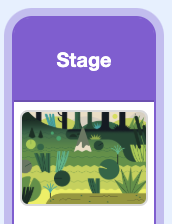

## Coder ton circuit

Write Scratch code so that your LED lights up when the player is near the hedgehog.

--- task --- Take the jumper wire off Pin 1 and attach it to **Pin 21** instead. Pin 21 is a pin which can be controlled with Scratch code.


--- /task ---

--- task ---

On the Raspberry Pi, download and open the [starter project](https://rpf.io/p/en/scratch-led-game-get){:target="_blank"}.

--- collapse ---
---
title: Ouverture d'un projet Scratch 3 Desktop téléchargé
---

Une fois que tu as téléchargé le fichier zip à partir du lien ci-dessus, ouvre ton gestionnaire de fichiers et accède au dossier **Téléchargements**.

Trouve le fichier que tu viens de télécharger. Il se terminera par `.zip`.

Right click on the file and choose 'Extract here' to extract them to your downloads folder.

Dans Scratch 3 Desktop, clique sur le menu `Fichier` et choisis `Importer depuis votre ordinateur`.

Navigue à nouveau vers ton dossier de téléchargements et sélectionne le fichier `scratch-physcomp1.sb3`.

Clique sur `OK` ou appuie sur `Enter`.

--- /collapse ---

--- /task ---

--- task ---

Make sure you have the **Stage** selected.



--- /task ---

--- task ---

Using the `Simple Electronics`{:class="block3extensions"} extension from the blocks menu, add the following blocks into the `if`{:class="block3control"} block.

```blocks3
when green flag clicked
forever
if <[0] < (dist) > then
+turn LED (21 v) [on v] ::led extension
else
+turn LED (21 v) [off v] ::led extension
end
```

If the distance to the hedgehog is less than it was before (ie. a number less than 0), the LED turns on — `else`{:class="block3control"} it turns off.

--- /task ---

--- task ---

Click on the green flag. Use the arrow keys and the LED to hunt the hedgehog!

--- /task ---

--- save ---
