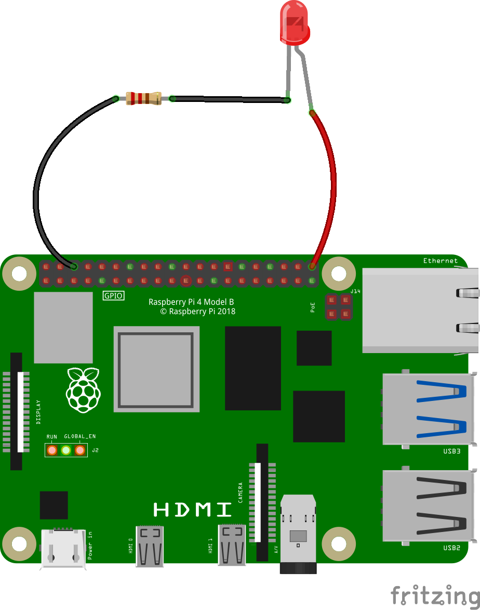

## Coder ton circuit

Dans cette étape, tu connecteras ton circuit terminé à une broche de sortie sur le Raspberry Pi et le contrôleras en utilisant l'extension `Simple Electronics`{:class="block3extensions"}.

Actuellement, ton circuit est testé et fonctionnel, et ta LED est allumée ; mais tu veux qu'elle s'allume quand quelque chose se passe dans ton programme Scratch.

Pour faire cela, tu dois connecter ton circuit LED à une broche de sortie sur le Raspberry Pi.

--- task --- Retire le fil de liaison de la broche 1 et fixe-le à n'importe quel autre broche numérotée. Dans cet exemple, j'ai utilisé la broche 21 (car elle est facile d'accès), mais tu peux utiliser n'importe quelle broche numérotée à usage général (GP) sur ton Raspberry Pi.




Si tu utilises une broche autre que la broche 21, assure-toi de changer le numéro **partout** où il apparaît dans ton code.

--- /task ---

--- task ---

Télécharge et ouvre le projet de démarrage [disponible ici](https://rpf.io/p/en/scratch-led-game-get){:target="_blank"}.

--- collapse ---
---
title: Ouverture d'un projet Scratch 3 Desktop téléchargé
---

Une fois que tu as téléchargé le fichier zip à partir du lien ci-dessus, ouvre ton gestionnaire de fichiers et accède au dossier **Téléchargements**.

Trouve le fichier que tu viens de télécharger. Il se terminera par `.zip`.

Fais un clic droit sur le fichier et choisis « Extraire les fichiers ». Extrais-les dans ton dossier de téléchargements.

Dans Scratch 3 Desktop, clique sur le menu `Fichier` et choisis `Importer depuis votre ordinateur`.

Navigue à nouveau vers ton dossier de téléchargements et sélectionne le fichier `scratch-physcomp1.sb3`.

Clique sur `OK` ou appuie sur `Enter`.


--- /collapse ---

--- /task ---

--- task ---

Assure-toi que la scène est sélectionnée et que tu peux voir les scripts suivants : 

--- /task ---

--- task ---

En utilisant l'extension `Simple Electronics`{:class="block3extensions"}, ajoute les blocs suivants dans le bloc `si`{:class="block3control"} de sorte que si `distance`{:class="block3variables"} est inférieur à `10`, la LED s'allume, `sinon`{:class="block3control"} elle s'éteint.

```blocks3
when green flag clicked
forever
if <[0] < (dist) > then
+turn LED (21 v) [on v] ::led extension
else
+turn LED (21 v) [off v] ::led extension
end
```

--- /task ---

--- task ---

Maintenant, clique sur le drapeau vert, et vois si tu peux chasser le hérisson !

--- /task ---

--- save ---
