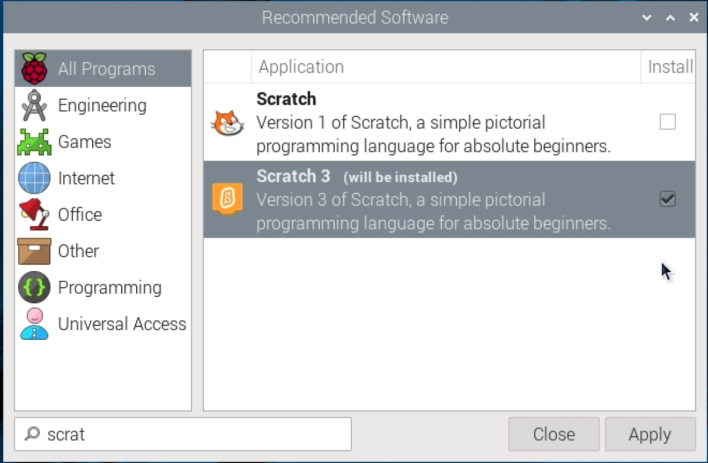

## You will make

Create a game where the player must find the hidden hedgehog. The LED turns on when you are close to the hedgehog.

--- no-print ---

### Play ▶️
View a 'virtual' version of the finished Physical Computing Project. Move your character around the screen using the arrow keys. When you move closer to the hedgehog, the LED will appear on the screen. If you move away, it will disappear.

  <iframe allowtransparency="true" width="485" height="402" src="https://scratch.mit.edu/projects/embed/492829675/?autostart=false" frameborder="0"></iframe>

--- /no-print ---

--- print-only ---

--- /print-only ---

## You will need

### Hardware

+ A Raspberry Pi computer
+ 3 x socket-to-socket jumper cables
+ an LED
+ a resistor (47-330Ω)

### Software

+ Scratch 3 Desktop - This project can not be completed using the online Scratch 3 editor, and must be completed using a Raspberry Pi with the desktop version installed.

--- collapse ---
---
title: Installing Scratch 3 desktop
---

Click on the Raspberry Pi logo, then **Preferences**, then **Recommended software**.

Find **Scratch 3** in the list of software, tick the box and then click **Apply** to install it.

--- /collapse ---
