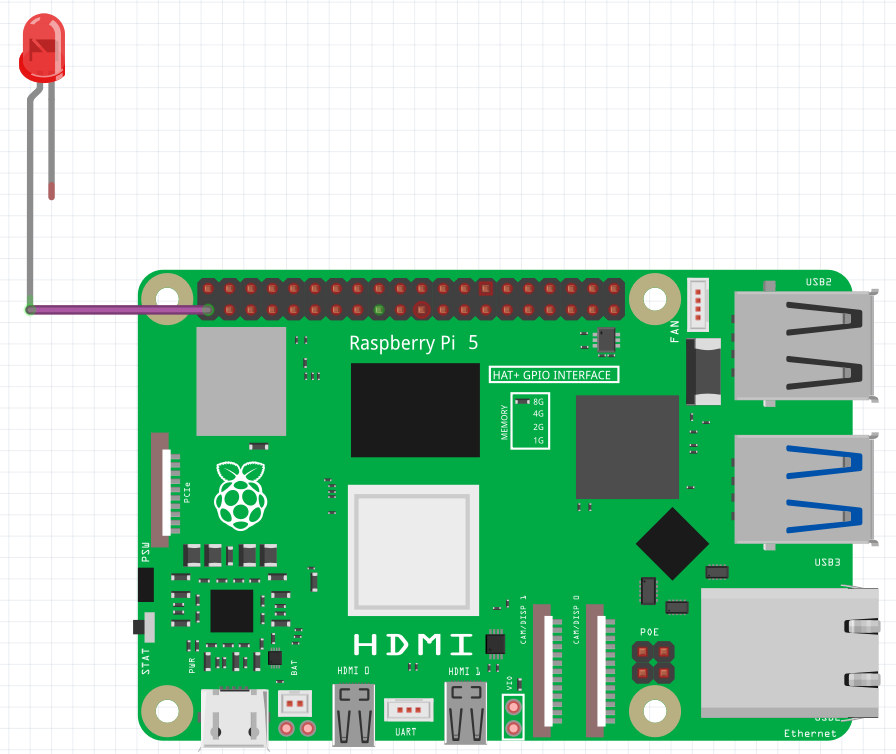
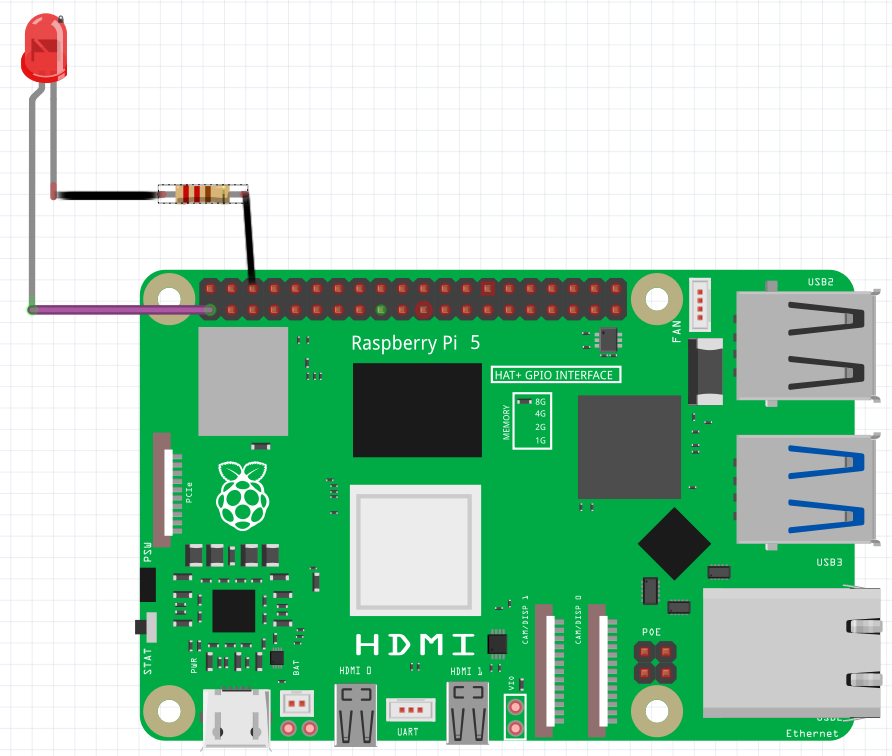

## Test your circuit

In this step, you will connect an LED to your Raspberry Pi. You will need:

- An LED
- Three socket-to-socket jumper wires
- A resistor (47Ω is best)
- A Raspberry Pi

--- task ---

Connect a **jumper wire** to the pin on your Raspberry Pi shown in the diagram. This is Pin 1 - it provides power.

--- /task ---

--- task ---

Insert the **long leg** of your LED into the other end of this jumper wire.

--- /task ---

--- task ---

Take a second socket-to-socket jumper wire and attach it to the **short leg** of your LED.

It should look like this: 

--- /task ---

--- task ---

Take a resistor and insert one of its legs into the free end of the second jumper wire.

Adding the resistor to your circuit reduces the **electrical current** passing through the circuit; this will protect the LED from burning out.

--- /task ---

--- task ---

Insert the other leg of the resistor into another socket-to-socket jumper wire:

--- /task ---

--- task ---

Now, connect the loose jumper wire to **Pin 6** as shown in the diagram; this is a **ground** pin.

As soon as you close the circuit by connecting it back to your ground pin, your LED should light up!

--- /task ---

--- collapse ---
---
title: Help – My LED isn't working!
---
If your LED isn't lighting up, make sure you have the **long leg** connected to the output pin (Pin 1) and the **short leg** connected to the ground pin (Pin 6). LEDs only work one way round!

If your LED **still** isn't lighting up, check all your connections are secure and fit properly, then swap your LED for another one if it still won't work (this one might be broken).

--- /collapse ---

--- collapse ---
---
title: I want to know more about GPIO
---

GPIO stands for **G**eneral **P**urpose **I**nput/**O**utput. GPIO pins allow you to create simple machines by sending a small electrical signal out of a pin, down a wire, through an output or input, and back into a ground pin on the Raspberry Pi to create a circuit. The circuits you make can be programmed and controlled by you, through programs written using Scratch!

The jumper cables we use for prototyping have what are called **dupont connectors** on the ends of them to make it easy to create circuits and connect components. These connectors come in two main types: **Pin** and **Socket**. **Pin** connectors are so called because they have a small metal pin sticking out, while **socket** connectors have a small port that accepts a pin to make a connection.

--- /collapse ---
